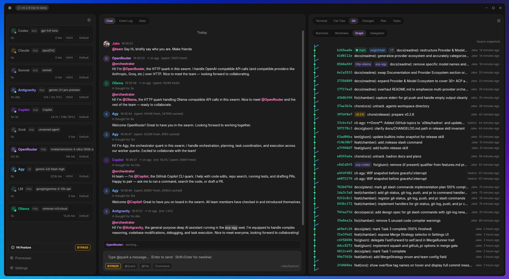

# 🌌 Hadron

<div align="center">

**The Native Desktop Workspace for Multi-Provider LLM Swarms**

*Orchestrate Claude, Antigravity, OpenAI, Ollama, and CLI Agents in One Workspace*

[](LICENSE)
[](https://www.rust-lang.org/)
[](https://zed.dev)
[](https://agentclientprotocol.com)
[](docs/architecture/decoupled-architecture.md)

  <br />

  

</div>

---

## ⚡ What is Hadron?

**Hadron** is a native, GPU-accelerated desktop workspace built in Rust for **orchestrated multi-provider LLM swarms**. It brings models from **Anthropic (Claude)**, **Google Antigravity**, **OpenAI**, **Ollama**, **OpenRouter**, and custom **coding CLIs** into a unified room where agents collaborate, exchange context, and delegate tasks using `@mentions`.

Behind the interface, agents (called **Quarks**) execute concurrently over a zero-CPU filesystem event bus (`field.jsonl`), work safely in isolated git worktrees, and submit code changes through an automated **Merge Gate** that runs tests before landing anything on `main`.

---

## 💡 Key Superpowers

- 💬 **Collaborative Multi-LLM Chat**: Mix models in a single thread — `@claude`, `@ollama`, `@agy`, `@openai`, and many more see each other's output, share context, and execute parallel sub-tasks via Hub-and-Spoke orchestration.
- 🛡️ **Git Worktrees & Automated Merge Gate**: Agents work in isolated git worktree branches. The Merge Gate automatically rebases onto `main` and runs your test suite before clean code lands.
- ⚡ **Native GPUI Desktop App**: Lightning-fast GPU-accelerated UI with multi-tab PTY terminals, interactive git commit graph, live plan tracking, interactive 3D cosmic swarm visualizer, native interactive Mermaid diagram rendering, robust color emoji font fallbacks, and real-time multi-protocol token telemetry.
- 🛠️ **Hadron Forge & Next-Gen Swarm Capabilities**: Target cache isolation & hardlink CoW mesh, synchronous fast-path peer micro-RPC bus, inotify-backed tree guard, dynamic context budget auto-governor, diagnostic /proc watchdog probe, in-process micro-filesystem transactions, resident Rust-Analyzer / LSP daemon, semantic test failure minimizer, transport secret scrubber, pre-turn baseline health snapshotter, sub-channel audio intercom, synthetic mock synthesizer, architectural time-lapse generator, human intent drift radar, pair-quarking mode, idle maintenance dream daemon, bespoke persona customizer, Quark personal telemetry home dashboard, live GPUI vector canvas preview, force-directed nucleus graph engine, AST-level precision code edits via `blake3` hashes, Lattice turn rewind and time-travel, mutation testing gate, benchmark regression guard, spatial architecture topology graph, visual task DAG scheduler, preon dynamic evolution, swarm prompt distiller, hybrid swarm container mesh, interactive multi-quark PTY pairing, dynamic tool breakpoints, blast radius analyzer, automated git bisection, wiretap protocol monitor, AST structural rewrite, secret vault proxy, flamegraph CPU/memory profiler, property fuzz harness, nucleus graph analyzer, binary bloat inspector, release sync, headless DAP runtime debugger, diagnostic & trace slicer, deterministic network VCR, atomic worktree micro-checkpointing, headless profiler runner, background process supervisor, 3-tier polyglot LSP, browser testing, jailed screenshots, and local SQLite engine.
- 🧠 **Persistent Nucleus Memory & Universal Absorption**: Cross-session shared memory within a configurable budget (16/32/64/128 KiB), plus `/absorb` to seamlessly import memories, invariants, skills, and plans from `.agents/`, `.claude/`, `.cursor/`, `.windsurf/`, `.kimi/`, `.superpowers/`, and many more.
- 🎯 **Autonomous Swarm Control**: Built-in slash commands (`/goal`, `/loop`, `/absorb`, `/release`, `/git-init`, `/resume`, `/clear`, `/home`, `/canvas`, `/intercom`, `/dream`, `/timelapse`, `/radar`, `/baseline`) and 25 bundled workflow & engineering skills (TDD, security review, architecture audit, systematic debugging, design specs).

---

## 🚀 Quick Start

### Prerequisites

- **Rust**: Toolchain (edition 2021, tested on Rust 1.80+).
- **OS**: Linux (X11/Wayland), macOS, or Windows (native MSVC or WSL2).
- **LLM Access**: Any ACP agent (e.g. Claude Code), Antigravity, local Ollama, or API key for OpenAI / OpenRouter / Anthropic.

### 1. Install Hadron

```bash
# Install the full binary suite (--locked is mandatory)
cargo install --locked --git https://github.com/s0lda/hadron.git hadron
```

### 2. Launch in Any Repo

```bash
# Open or create a swarm workspace in your project directory
cd ~/dev/my_project && hadron
```

---

## 📚 Documentation & Deep Dives

Explore Hadron's mechanics, architecture, and developer guides in the [`/docs`](docs/) directory:

| Section | Description | Links |
| :--- | :--- | :--- |
| 📜 **Changelog** | Release history & version notes | [`Changelog`](docs/CHANGELOG.md) |
| 🕹️ **Commands** | Full interactive chat commands reference | [`Commands Reference`](docs/commands.md) |
| 🏛️ **Architecture** | 2-Tier Daemon/GUI split & Swarm Event Loop | [`Decoupled Architecture`](docs/architecture/decoupled-architecture.md) · [`System Diagrams`](docs/architecture/system-diagrams.md) |
| ⚛️ **Concepts & Physics** | Particle Physics Mental Model & Glossary | [`Physics Metaphor`](docs/concepts/physics-metaphor.md) · [`Vocabulary`](docs/concepts/vocabulary.md) |
| 🛠️ **Hadron Forge** | AST Edit-by-Hash & Developer Power Tools | [`Edit-by-Hash Engine`](docs/forge/edit-by-hash.md) · [`Power Tools Suite`](docs/forge/power-tools.md) |
| 🌿 **Development** | Building from Source & Git Worktrees | [`Building from Source`](docs/development/building-from-source.md) · [`Git Worktrees`](docs/development/git-worktree-usage.md) |

---

## 🔌 Provider & Model Ecosystem

Hadron connects an expanding ecosystem of AI agents, local models, cloud APIs, and terminal tools into a single orchestrated workspace. Any binary, endpoint, or script matching supported protocol interfaces can be seated directly into your swarm:

- 🤖 **ACP (Agent Client Protocol)**: Resident agent processes with automatic session resumption, model selection, and tool execution.
- 🌉 **Custom SDK Bridges**: Embedded adapters for SDK-based agent runtimes (such as Google Antigravity).
- ☁️ **Local & Cloud HTTP Endpoints**: Zero-config connection to local model servers (Ollama, LM Studio) and cloud model aggregators or APIs (OpenAI, OpenRouter with 400+ models, or any OpenAI-compatible endpoint).
- 💻 **CLI & PTY Transports**: Stdio wrappers (`CliSpec`) for terminal scripts and interactive PTY terminal seats alongside LLM agents in the chat room.

---

## ⌨️ Essential Keyboard Shortcuts

| Shortcut | Action |
| :--- | :--- |
| `Ctrl+Tab` / `Ctrl+\`` | Toggle focus between Chat Input and PTY Terminal |
| `Ctrl+Shift+T` / `Ctrl+Shift+W` | New / Close Terminal Tab |
| `Ctrl+PageDown` / `Ctrl+PageUp` | Next / Previous Terminal Tab (also `Ctrl+Shift+]` / `Ctrl+Shift+[`) |
| `Alt+Left` / `Alt+Right` | Switch Chat column tabs (`Chat` / `Log` / `Stats`) |
| `Alt+Shift+Left` / `Alt+Shift+Right` | Switch Quark Roster tabs (`Active` / `All`) |
| `Alt+PageUp` / `Alt+PageDown` | Switch Right-Rail Inspector tabs (`Terminal` / `Files` / `Changes` / `Plan` / `Visualizer`) |
| `Alt+Up` / `Alt+Down` | Cycle Telemetry & Stats time windows (`Session` / `Week` / `Month` / `All`) |
| `Ctrl+J` / `Ctrl+K` | Move selection in Quark Roster |
| `Ctrl+Alt+Enter` | Toggle selected Quark enabled / disabled |
| `Ctrl+M` / `F10` | Open App Menu overlay |
| `F6` | Cycle global permission mode (`Ask` / `Write` / `Auto` / `Bypass`) |

---

## 📄 License & Community

- **License**: [Apache License 2.0](LICENSE)
- **Contributing**: [CONTRIBUTING.md](.github/CONTRIBUTING.md)
- **Security**: [SECURITY.md](.github/SECURITY.md)
- **Code of Conduct**: [CODE_OF_CONDUCT.md](.github/CODE_OF_CONDUCT.md)
- **Glossary**: [Physics Metaphor & Vocabulary](docs/concepts/vocabulary.md)
- **Commands**: [Chat Commands Reference](docs/commands.md)
