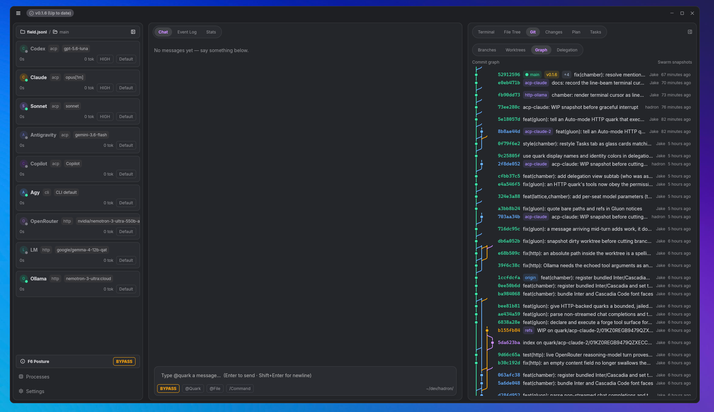

# 🌌 Hadron

<div align="center">

**The Native Desktop Workspace for Multi-Provider LLM Swarms**

*Orchestrate Claude, Antigravity, OpenAI, Ollama, and CLI Agents in One Workspace*

[](LICENSE)
[](https://www.rust-lang.org/)
[](https://zed.dev)
[](https://agentclientprotocol.com)
[](docs/architecture/decoupled-architecture.md)

  <br />

  

</div>

---

## ⚡ What is Hadron?

**Hadron** is a native, GPU-accelerated desktop workspace built in Rust for **orchestrated multi-provider LLM chat**. It brings models from **Anthropic (Claude)**, **Google Antigravity**, **OpenAI**, **Ollama**, **OpenRouter**, and custom **coding CLIs** into a unified room where agents collaborate, exchange context, and delegate tasks using `@mentions`.

Behind the interface, agents (called **Quarks**) execute concurrently over a zero-CPU filesystem event bus (`field.jsonl`), work safely in isolated git worktrees, and submit code changes through an automated **Merge Gate** that runs tests before landing anything on `main`.

---

## 💡 Key Superpowers

- 💬 **Collaborative Multi-LLM Chat**: Mix models in a single thread — `@claude`, `@ollama`, `@agy`, and `@openai` see each other's output, share context, and execute parallel sub-tasks.
- 🛡️ **Git Worktrees & Automated Merge Gate**: Agents work in isolated git worktree branches. The Merge Gate automatically rebases onto `main` and runs your test suite before clean code lands.
- ⚡ **Native GPUI Desktop App**: Lightning-fast GPU-accelerated UI with interactive PTY terminals, live git visualizer, and real-time per-agent token telemetry.
- 🛠️ **Hadron Forge (Edit-by-Hash)**: AST-level precision code edits using `blake3` cryptographic hashes for zero-drift mutations.
- 🧠 **Context7 & Superpowers**: Integrated documentation search and 15 bundled workflow skills (TDD, systematic debugging, design specs).

---

## 🚀 Quick Start

### Prerequisites

- **Rust**: Toolchain (edition 2021, tested on Rust 1.80+).
- **OS**: Linux (X11/Wayland), macOS, or Windows (native MSVC or WSL2).
- **LLM Access**: Any ACP agent (e.g. Claude Code), Antigravity, local Ollama, or API key for OpenAI / OpenRouter / Anthropic.

### 1. Install Hadron

```bash
# Install the full binary suite (--locked is mandatory)
cargo install --locked --git https://github.com/s0lda/hadron.git hadron
```

### 2. Launch in Any Repo

```bash
# Open or create a swarm workspace in your project directory
cd ~/dev/my_project && hadron
```

---

## 🔌 Provider & Model Ecosystem

Hadron natively bridges **30+ AI agents, local models, and cloud APIs** into a single orchestrated chat workspace. Any agent, model, or tool speaking **ACP (Agent Client Protocol)**, **OpenAI-compatible HTTP**, or **Stdio/PTY** can be seated directly into your swarm.

### 🤖 ACP Agent Swarm (Native Presets & ACP Registry)
Hadron boots and orchestrates resident ACP agents with automatic session resumption, model selection, and tool calls:
- **Featured ACP Agents**: `Claude Code` (`claude`), `Codex CLI` (`codex`), `Gemini CLI` (`gemini`), `GitHub Copilot` (`copilot`), `Google Antigravity` (`agy`)
- **Supported Ecosystem ACP Agents**: `Goose`, `Cursor`, `Cline`, `OpenHands`, `OpenCode`, `Kimi CLI`, `Mistral Vibe`, `Qwen Code`, `Factory Droid`, `Augment Code`, `Blackbox AI`, `Pi`, `Poolside`, `Qoder CLI`, `Hermes Agent`, `Junie`, `Kiro`, `OpenClaw`, `AgentPool`, `AutoDev`, `cagent (Docker)`, `stdio Bus`, `VT Code`, and any custom binary speaking ACP!

### 🏠 Local Models (Offline & Private)
Direct zero-config local server integration:
- **Ollama**: Auto-detects local models (`llama3.3`, `deepseek-r1`, `qwen2.5-coder`, `mistral`, `phi-4`) over `localhost:11434`
- **LM Studio**: Local OpenAI-compatible server (`localhost:1234/v1`) with zero-latency local token streaming

### ☁️ Cloud HTTP & OpenAI-Compatible Endpoints
Connect to any cloud model provider or API proxy via `Authorization: Bearer` keys:
- **OpenAI**: `GPT-4o`, `o1`, `o3-mini`, `GPT-4-turbo`
- **OpenRouter**: Access 200+ models (`DeepSeek R1/V3`, `Claude 3.5 Sonnet`, `Llama 3.3 70B`, `Qwen 2.5 72B`)
- **Cloud APIs**: Direct support for `Groq`, `Together AI`, `Fireworks AI`, `DeepSeek API`, `Mistral API`, `SambaNova`, or self-hosted vLLM / TGI endpoints

### 💻 Custom Coding CLIs & PTY Transports
- **CLI Transport (`CliSpec`)**: Data-driven stdio wrapper for one-shot or interactive CLI coding tools (`aider`, custom scripts, dockerized agents).
- **PTY Terminal Seats**: Interactive bash/zsh PTY terminals seated right alongside LLM agents in the chat room.

---

## 📚 Documentation & Deep Dives

Explore Hadron's mechanics, architecture, and developer guides in the [`/docs`](docs/) directory:

| Section | Description | Links |
| :--- | :--- | :--- |
| 📜 **Changelog** | Release history & version notes | [`Changelog`](docs/CHANGELOG.md) |
| 🏛️ **Architecture** | 2-Tier Daemon/GUI split & Swarm Event Loop | [`Decoupled Architecture`](docs/architecture/decoupled-architecture.md) · [`System Diagrams`](docs/architecture/system-diagrams.md) |
| ⚛️ **Concepts & Physics** | Particle Physics Mental Model & Glossary | [`Physics Metaphor`](docs/concepts/physics-metaphor.md) · [`Vocabulary`](docs/concepts/vocabulary.md) |
| 🛠️ **Hadron Forge** | AST Edit-by-Hash Engine & MCP Server | [`Edit-by-Hash Engine`](docs/forge/edit-by-hash.md) |
| 🌿 **Development** | Building from Source & Git Worktrees | [`Building from Source`](docs/development/building-from-source.md) · [`Git Worktrees`](docs/development/git-worktree-usage.md) |

---

## ⌨️ Essential Keyboard Shortcuts

| Shortcut | Action |
| :--- | :--- |
| `Ctrl+Tab` / `Ctrl+\` | Toggle focus between Chat Input and PTY Terminal |
| `Alt+Left` / `Alt+Right` | Switch Chat column tabs |
| `Alt+PageUp` / `Alt+PageDown` | Switch Right-Rail Inspector tabs (Git / Files / Telemetry) |
| `Alt+Up` / `Alt+Down` | Cycle Telemetry & Stats time windows |
| `F6` | Cycle global permission mode (`Ask` / `Write` / `Auto` / `Bypass`) |

---

## 📄 License & Community

- **License**: [Apache License 2.0](LICENSE)
- **Contributing**: [CONTRIBUTING.md](.github/CONTRIBUTING.md)
- **Security**: [SECURITY.md](.github/SECURITY.md)
- **Code of Conduct**: [CODE_OF_CONDUCT.md](.github/CODE_OF_CONDUCT.md)
- **Glossary**: [Physics Metaphor & Vocabulary](docs/concepts/vocabulary.md)
