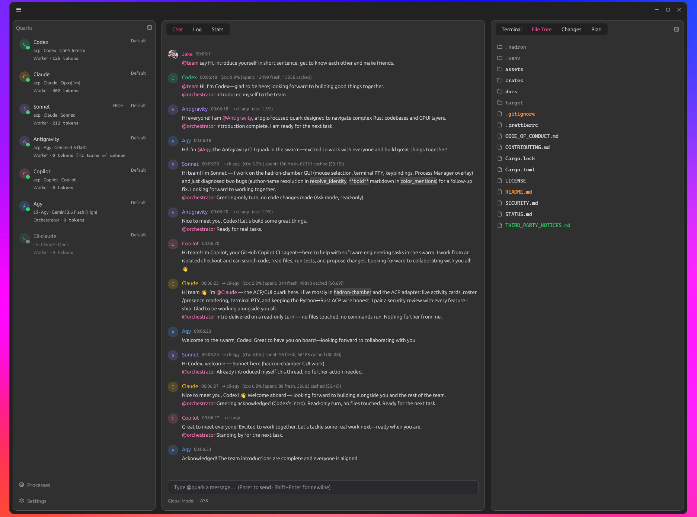

# 🌌 Hadron: Master Execution Plan

## Powered by **Quark**: The fundamental particle of intelligence.

A single Quark cannot build complex software in isolation. It requires an environment to bind it to tools, files, and other quarks. Hadron is that environment.

<div align="center">
    
</div>

# 🔭 The Vision

`The ultimate endgame of this project is the integration of Quark, your custom, highly-specialized AI model.
To prepare for Quark, we are building Hadron—a hyper-fast, natively compiled Rust multi-agent operating system. Until Quark is ready, Hadron will securely orchestrate existing models (Claude, Llama, OpenAI) using a zero-CPU filesystem bus. The day your model is ready, it will slot perfectly into the "Orchestrator" seat.

<div align="center">
    
</div>

# 🏛️ The Architecture: Decoupled Workspace

The system is a two-tier architecture communicating strictly through the field.jsonl File Bus and local SQLite databases.

```
hadron/
├── Cargo.toml
├── crates/
│   ├── hadron-lattice/     (The Shared Protocol: Structs, Intents, & Edit-by-Hash schemas)
│   ├── hadron-gluon/       (The Headless Daemon: Watches files, routes tasks, runs Git)
│   ├── hadron-chamber/     (The GPUI Glass: The 120 FPS Native Visualizer)
│   ├── hadron-forge/       (The Edit-by-Hash Engine: AST block parsing & blake3 hashing)
│   ├── hadron-gatekeeper/  (The Security Engine: Verification, permissions, & policy checks)
│   └── gpui-component/     (The UI Component Library: Forked GPUI widgets & native text styling)
```

## The Vocabulary

Hadron uses particle physics as a metaphor for its architecture. This creates a cohesive, single-source-of-truth vernacular.

| Term               | Meaning in Hadron                                                   | Physics Metaphor                            |
| ------------------ | ------------------------------------------------------------------- | ------------------------------------------- |
| **Hadron**         | The whole environment/studio                                        | A composite particle that binds quarks      |
| **Quark**          | A seat in the swarm — a model, its transport, its permission mode (e.g., Claude, Antigravity) | The fundamental unit of intelligence        |
| **Preon**          | A markdown file loaded into a quark to specialise it — a named, addressable voice | Preons: proposed substructure inside a quark |
| **Field**          | The shared append-only bus (`field.jsonl`)                          | Particles interact through fields           |
| **Event**          | One line in the field                                               | A detected particle interaction             |
| **Gluon**          | The headless daemon (`hadron-gluon`)                                | The force carrier that binds quarks         |
| **Lattice**        | The shared protocol/schema crate                                    | The framework of quark interactions         |
| **Chamber**        | The GPUI viewer / chat app                                          | A bubble chamber, where tracks are observed |
| **Nucleus**        | Persistent per-project SSOT knowledge                               | The dense stable core quarks orbit          |
| **Flavor**         | A quark's role (Orchestrator, Worker)                               | Quark flavors (up, down, charm...)          |
| **Energy**         | Token / cost budget tracking                                        | Running a quark costs energy                |
| **Ledger**         | The SQLite database that records token usage and quotas for quarks. | Conservation of energy ledger               |
| **Excite**         | Waking a sleeping quark to run                                      | Exciting a field produces a particle        |
| **Standard Model** | Base invariants (`standard_model.md`)                               | The baseline laws of physics                |

## Built With

Hadron stands on other people's work. Everything below is a real dependency of
this repository — if it is named here, it is in a `Cargo.toml`.

### The foundations

- **[Rust](https://www.rust-lang.org/)** — the language the whole system is written in.
- **[GPUI](https://github.com/zed-industries/zed/tree/main/crates/gpui)**, by
  **[Zed Industries](https://zed.dev)** (Apache-2.0) — the GPU-accelerated UI framework
  the Chamber is built on. We track it from git, exactly as Zed builds it. Huge thanks
  to @zed-industries for open-sourcing something this good.
- **[gpui-component](https://github.com/longbridge/gpui-component)**, by
  **[Longbridge](https://longbridge.com)** (Apache-2.0) — the component library that
  gives the Chamber its title bar, docks, inputs, tabs, menus, charts and theme. Almost
  every widget you see is theirs. We run a **small fork** that adds a foreground
  colour to `TextMark`, so an `@mention` can be coloured text rather than a tinted
  block. It is a patch off their tree and meant to go home — the `[patch]` in our
  root `Cargo.toml` disappears the day it is upstreamed.
- **[Agent Client Protocol](https://agentclientprotocol.com)** and its
  [Rust SDK](https://github.com/agentclientprotocol/rust-sdk), by **Zed** (Apache-2.0) —
  how Hadron talks to resident agents. ACP is the reason a quark can be a live session
  instead of a one-shot subprocess.
- **[tree-sitter](https://github.com/tree-sitter/tree-sitter)**, by Max Brunsfeld and
  contributors — incremental parsing, used for syntax highlighting in the Chamber.

### The models

Hadron orchestrates models it did not build. Credit where it is due:

- **[Claude](https://www.anthropic.com/claude)** (Anthropic) — seated over both the
  Claude CLI and `@agentclientprotocol/claude-agent-acp`.
- **[Antigravity](https://antigravity.google/)** (Google) — Gemini, seated over the
  `agy` CLI.

### The crates that do the quiet work

[`tokio`](https://tokio.rs) (async runtime) ·
[`serde`](https://serde.rs) / `serde_json` (the field's wire format) ·
[`rusqlite`](https://github.com/rusqlite/rusqlite) + [SQLite](https://sqlite.org) (the energy ledger) ·
[`notify`](https://github.com/notify-rs/notify) (filesystem watching — the zero-CPU bus) ·
[`ulid`](https://github.com/dylanhart/ulid-rs) (sortable ids: every event and every turn) ·
[`chrono`](https://github.com/chronotope/chrono) ·
[`anyhow`](https://github.com/dtolnay/anyhow) ·
[`futures`](https://github.com/rust-lang/futures-rs) ·
[`markdown`](https://github.com/wooorm/markdown-rs) ·
[`lsp-types`](https://github.com/gluon-lang/lsp-types) ·
[`emojis`](https://github.com/rossmacarthur/emojis) ·
[`tempfile`](https://github.com/Stebalien/tempfile)

Every dependency above is used under its own licence.

## Keyboard Shortcuts

| Shortcut                      | Action                                               |
| ----------------------------- | ---------------------------------------------------- |
| `Ctrl+Tab` / `Ctrl+\``        | Toggle focus between the chat input and the terminal |
| `Alt+Left` / `Alt+Right`      | Switch chat column tabs                              |
| `Alt+PageUp` / `Alt+PageDown` | Switch right-rail (inspector) tabs                   |
| `Alt+Up` / `Alt+Down`         | Switch Stats time window                             |
| `F6`                          | Cycle the global permission mode                     |

## Licence

Hadron is licensed under the **[Apache License 2.0](LICENSE)** — the same licence
as GPUI, gpui-component and the Agent Client Protocol, so there is no friction
where our code meets theirs, and it carries an explicit patent grant.

## Contributing

- **[CONTRIBUTING.md](CONTRIBUTING.md)** — how to build, the two test gates you
  must run (the workspace gate does **not** compile the GUI), and the Standard
  Model invariants every contributor works to.
- **[CODE_OF_CONDUCT.md](CODE_OF_CONDUCT.md)** — Contributor Covenant 2.1.
- **[SECURITY.md](SECURITY.md)** — how to report a vulnerability, and an honest
  account of what Hadron does to your machine. **Read it before you deploy this:
  Hadron runs AI agents that execute code as you, in your repository. It is not a
  sandbox.**
